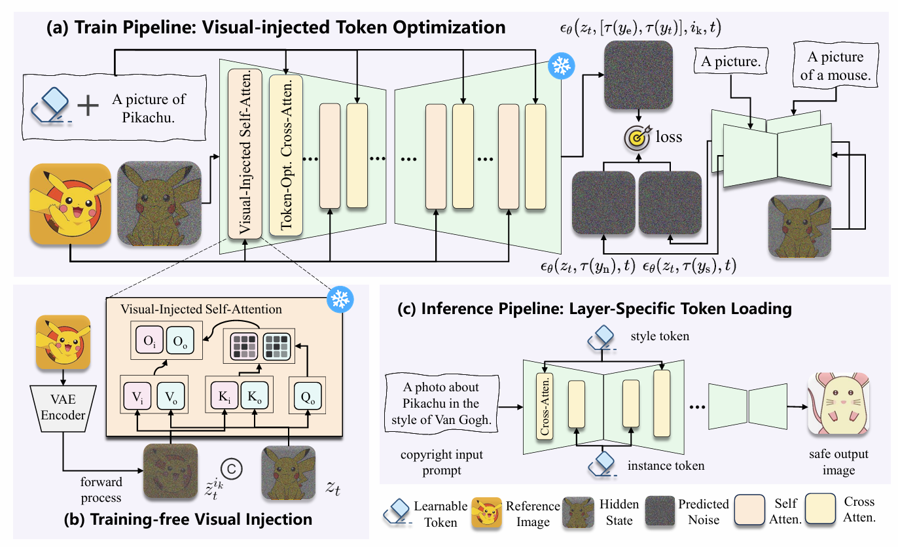
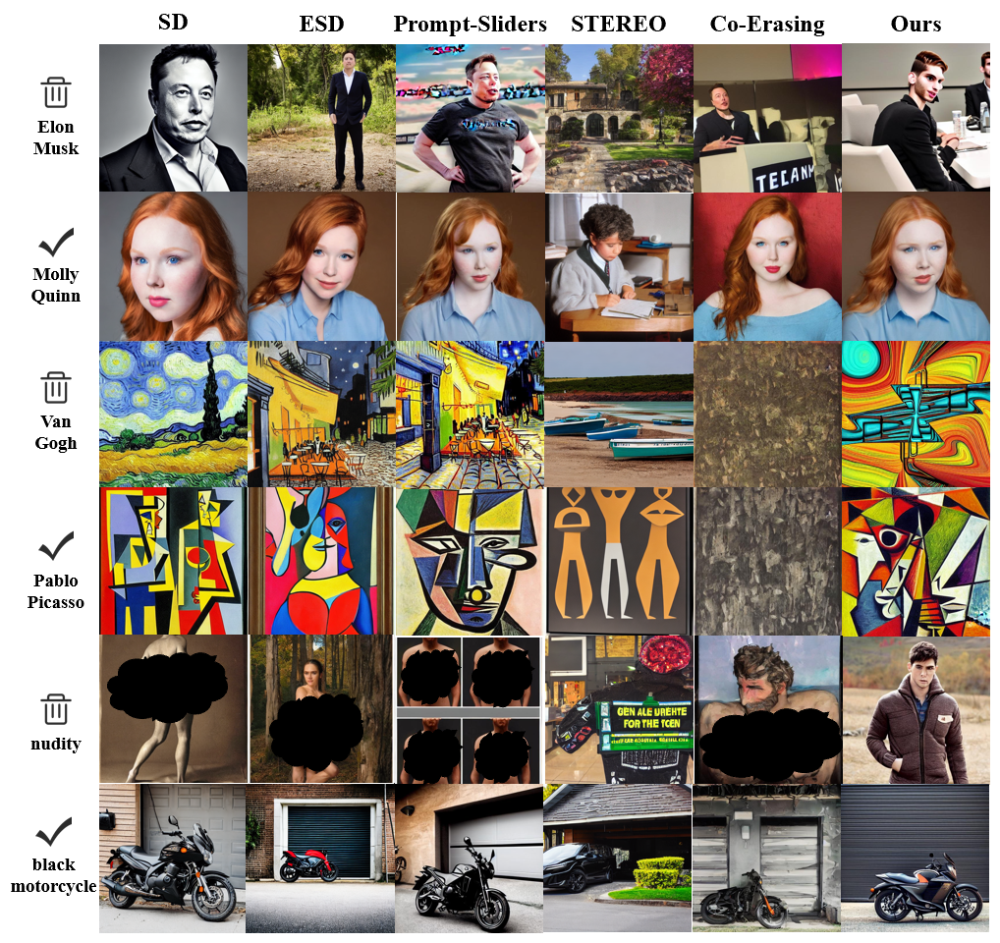

# TokenErase: Robust Concept Erasure via Visual-Injected Token Optimization

[](https://openaccess.thecvf.com/content/CVPR2026F/papers/Zou_TokenErase_Robust_Concept_Erasure_via_Visual-Injected_Token_Optimization_CVPRF_2026_paper.pdf) 
[](https://github.com/xszz666/TokenErase)


Official PyTorch implementation of the paper **"TokenErase: Robust Concept Erasure via Visual-Injected Token Optimization"**.

## 📖 Overview

Concept erasure is essential to prevent diffusion models from producing copyrighted or unsafe content. However, existing methods often suffer from limited robustness against adversarial attacks or require heavy computational overhead. 

**TokenErase** is a lightweight, plug-and-play framework that achieves robust concept erasure through two complementary modules:
1. **Visual-Injected Self-Attention (VISA):** A training-free mechanism that seamlessly integrates image information into the U-Net self-attention to guide concept suppression.
2. **Token-Optimizing Cross-Attention (TOCA):** A parameter-efficient fine-tuning approach that freezes the U-Net and optimizes only a single learnable text token for precise concept removal.




## 🛠️ Installation

```bash
git clone https://github.com/xszz666/TokenErase.git
cd TokenErase
conda env create -f environment.yml
```

## 🚀 Quick Start
### 1. Training (Concept Erasure)
To erase a specific concept (e.g., "Elon Musk"), you can optimize the learnable token using the following command:

```bash

export CUDA_VISIBLE_DEVICES=0
export MODEL_NAME="stable-diffusion-v1-5/stable-diffusion-v1-5"
export CONCEPT="Van_Gogh"
export INIT="art"

# 确保输出目录存在
mkdir -p outputs/$CONCEPT/

# 运行训练（参考图像配置从YAML读取）
accelerate launch train.py \
    --pretrained_model_name_or_path=$MODEL_NAME \
    --learnable_property="object" \
    --placeholder_token="<$CONCEPT-lora>" \
    --initializer_token="$INIT" \
    --mixed_precision="no" \
    --train_batch_size=1 \
    --gradient_accumulation_steps=1 \
    --max_train_steps=500 \
    --text_train_steps=200 \
    --learning_rate=5.0e-04 \
    --scale_lr \
    --lr_scheduler="constant" \
    --lr_warmup_steps=0 \
    --save_as_full_pipeline \
    --output_dir=outputs/$CONCEPT/ \
    --prompts_file="data/$CONCEPT.yaml"

```

### 2. Inference
Load the optimized token to generate safe images without the erased concept:
```bash
python inference.py 
```

## 📊 Results
TokenErase achieves state-of-the-art TokenErase achieves state-of-the-art trade-offs between **Erasure Efficacy** and **Generative Usability** across multiple tasks:
- **Celebrity Erasure** (e.g., Elon Musk)
- **Artistic Style Erasure** (e.g., Van Gogh)
- **Nudity/NSFW Erasure**




## 🙏 Acknowledgments

This project is built upon or inspired by the following excellent open-source projects. We thank the authors for their phenomenal contributions to the community:

* [Stable Diffusion](https://github.com/CompVis/stable-diffusion)
* [Textual Inversion](https://github.com/rinongal/textual_inversion)
* [Prompt Sliders](https://github.com/DeepakSridhar/promptsliders)
* [FreeCustom](https://github.com/aim-uofa/FreeCustom)

## 🎓 Citation
If you find our work helpful, please consider citing our paper:

```Bibtex
@InProceedings{Zou_2026_CVPR,
    author    = {Zou, Liangshun and Ni, Zhangkai and Wang, Hanli},
    title     = {TokenErase: Robust Concept Erasure via Visual-Injected Token Optimization},
    booktitle = {Proceedings of the IEEE/CVF Conference on Computer Vision and Pattern Recognition (CVPR) Findings},
    month     = {June},
    year      = {2026},
    pages     = {4129-4139}
}
```

## ✉️ Contact
For any questions or suggestions, please contact me [here](mailto:2152611@tongji.edu.cn).

